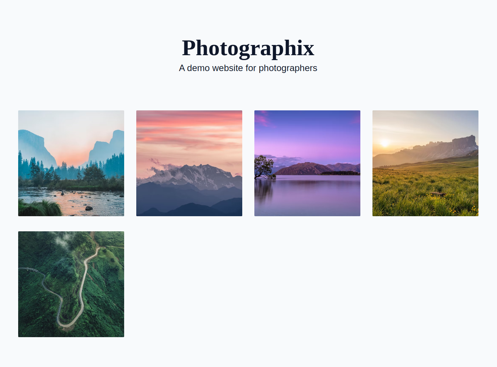

# Photographix

A portfolio site for a photographers.

Made with Nextjs, TailwindCSS, [DatoCMS](https://datocms.com) and Typescript.



## Getting Started

Either deploy it with this button:

[](https://dashboard.datocms.com/deploy?repo=lanasdev%2Fphotography-portfolio%3Amain)

Or clone the repo and run it locally:

```bash

yarn install

yarn dev

```

## Features

- [x] The website is fully responsive & static generated
- [x] The website is fully customizable with [DatoCMS](https://datocms.com)
- [x] Pictures are lazy loaded with placeholders and blur up effect
